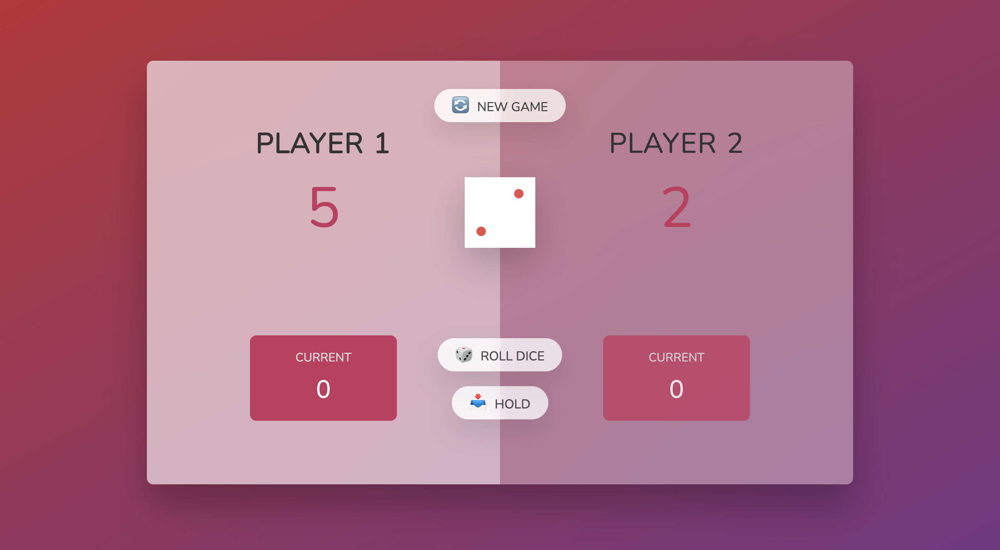
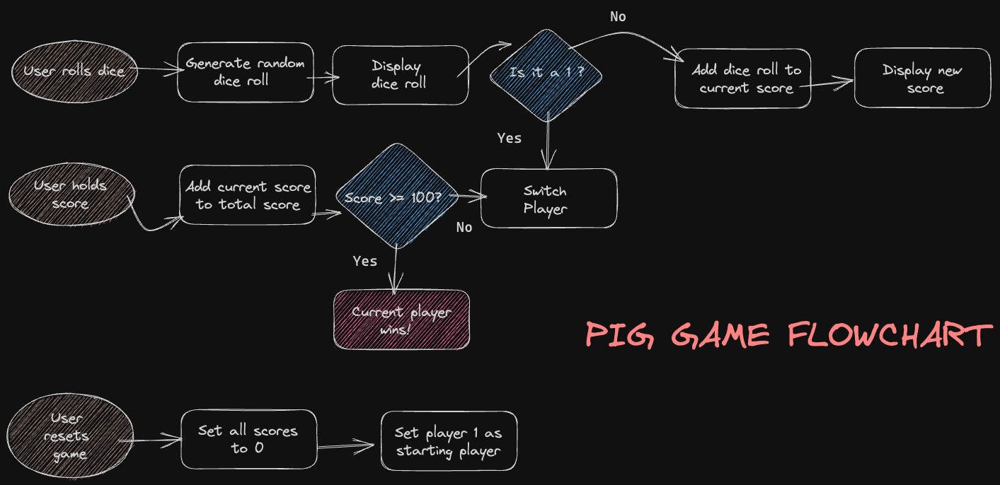
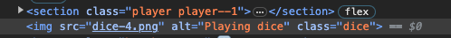
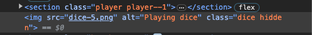
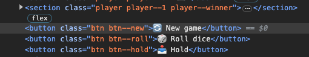

# GitHub Pages

https://kkyhh.github.io/Pig-Game/



### 설명

---

주사위를 던져 나온 숫자를 기록해서 합이 먼저 100 이상 되는 사람이 이기는 게임 주사위를 1이 나올 때 까지 던지거나 저장 할 수 있지만 1이 나오면 얻은 점수는 모두 지워지고 차례는 상대에게 넘어간다 저장을 하면 차례는 넘어가지만 그 차례에서 얻은 점수를 모두 얻는다

### 기록

---


플로우차트를 통해서 논리적인 구조파악을 하는것이 어떤건지 알게 되었다. 생각만으로 하는것 보다 명확하게 만들어 갈 수 있는것 같다. 아직 생각이 완벽하게 그려지지는 않지만 간략하게라도 차트를 그려보는 시도를 해봐야겠다.
<br><br>

`Scope`

보통 어떤걸 초기화 시키거나 처음으로 돌아가게 만든다면 페이지를 리로드를 한다는 생각만 있었는데 함수를 만들어 초기화 하는 방법을 사용했다

```javascript
let scores, currentScore, activePlayer, playing;

// Starting conditions
const init = function () {
  // const scores = [0, 0];
  // let currentScore = 0;
  // let activePlayer = 0;
  // let playing = true;

  scores = [0, 0];
  currentScore = 0;
  activePlayer = 0;
  playing = true;

  score0El.textContent = 0;
  score1El.textContent = 0;
  current1El.textContent = 0;
  current0El.textContent = 0;

  diceEl.classList.add('hidden');
  player0El.classList.remove('player--winner');
  player1El.classList.remove('player--winner');
  player0El.classList.add('player--active');
  player1El.classList.remove('player--active');
};
init();
```

주석처리된 코드는 원래 전역변수 였지만 `init` 함수를 사용하기 위해 넣었는데 적용이 안됐었다. 그래서 `let`으로 전역에 선언만 하고 함수 내에서 사용하였다. 이 과정에서 스코프의 종류와 정의에 대해서 알아보았다

`Global Scope`

```javascript
const globalVariable = "I am global!";

function globalFunction () {
	console.log("I am also global!");
```

전역 스코프에 선언된 변수 및 함수는 어디서나 접근 가능하다. 프로그램 전체에서 사용할 수 있다.

`Local Scope` 와 `Block Scope` 의 차이

지역 스코프와 블록 스코프는 유사하지만 차이가 있다. 기본적으로 함수 내에 선언된 변수는 지역 스코프를 가지며 함수 내에서만 접근 가능하다. `ES6`에 도입된 `let`과`const` 키워드로 선언된 변수는 블록 스코프를 가진다.

`함수 스코프`

```javascript
function exampleFunction() {
  var functionScopedVar = 'I am function scoped'; // 함수 스코프 변수
  if (true) {
    var innerVar = 'I am also function scoped'; // 여전히 함수 스코프 변수
  }
  console.log(functionScopedVar); // 접근 가능
  console.log(innerVar); // 접근 가능
}
```

`블록 스코프`

```javascript
function exampleBlockScope() {
  if (true) {
    let blockScopedVar = 'I am block scoped'; // 블록 스코프 변수
    const anotherBlockVar = 'I am also block scoped'; // 블록 스코프 변수
  }
  console.log(blockScopedVar); // 에러: 접근 불가능
  console.log(anotherBlockVar); // 에러: 접근 불가능
}
```

`let` 과 `const`로 선언된 변수는 중괄호로 둘러싸인 블록 내에서만 유효하므로 블록 스코프를 가진다. 특히 조건문,반복문,함수 등과 같은 블록 내에서 변수를 보호하고 충돌을 방지하는데 도움이 된다. 반면 `var` 로 선언된 변수는 함수 스코프를 가지므로 이런 이점을 제공하지 않는다. `ES6`에서는 `let`과`const`를 사용하여 블록 스코프로 정의하는것이 권장된다.

`document.getElementById`\
`document.querySelector`

```javascript
<html>
<h2 class="name" id="name--0">Player 1</h2>

<script>
document.getElementById('name--0');
document.querySelector('.name');
```

`document.getElementById` 는 html 의 id 를 선택\
`document.querySelector` 는 html 의 class 를 선택

`classList`

classList는 DOM 요소의 클래스 목록을 나타내는 JavaScript 객체이다. 클래스 추가,제거 및 토글 기능을 제공한다.

- add

```javascript
diceEl.classList.add('hidden');
```

지정된 요소에 hidden 클래스를 추가한다. 다른 사이트의 정보를 보고싶어서 개발자도구로 보면 hidden 이라는게 많이 보였었다. 그 땐 정확히 어떤 작용을 하는지 몰랐는데 `classList.add`를 통해서 해당 클래스를 부여하고 hidden CSS에 해당하는 작업을 넣을 수 있다는걸 알았다.

- remove

```javascript
classList.remove('player--active');
// diceEl.remove('hidden');
diceEl.classList.add('hidden');
```

add와는 반대로 요소의 클래스를 삭제한다.

클릭시 hidden 클래스를 추가해 요소를 없애는게 목적이였다. 처음에는 '`diceEl`에 hidden 클래스를 삭제한다' 라고 헷갈려 잘못된 생각으로 주석처리된 코드를 넣었는데 원하는 결과가 나와서 넘어갔었다가 뒤늦게 `classList`가 빠진걸 알았고 아래코드로 수정을 했다. 하지만 왜 같은 결과가 나온건지 이해가 안되서 살펴보았다

게임이 끝나면 dice 그림이 사라지는 기능

`hidden`


play 중에는 dice 클래스로만 잘 보인다



게임이 종료되면 `diceEl.classList.add('hidden)` 으로 hidden 클래스가 추가되며 주사위는 사라진다.

`remove`



반대로 `diceEl.remove('hidden');` 는 hidden과 상관없이 그냥 `diceEl`을 삭제해버리는 작용을 하는것 같다.

삭제로 그림이 없어지다보니 처음에는 작동이 잘 된다고 생각하고 넘어갔었다. 앞으로 주의할 것

- toggle

```javascript
player0El.classList.toggle('player--active');
```

클래스가 요소에 있다면 제거하고 없으면 추가한다. `player0El`에 `player--active` 클래스가 있으면 없애고 없으면 추가를 하는 기능이다. 버튼기능에 유용하게 쓰일 수 있을거 같다.

- contains

```javascript
if (element.classList.contains('active')) {
  // 클래스가 존재함
}
```

지정된 클래스가 존재하면 `true`를 반환하고 없다면 `false`를 반환한다

- replace

```javascript
element.classList.replace('old-class', 'new-class');
```

요소의 클래스를 다른 클래스로 교체한다
